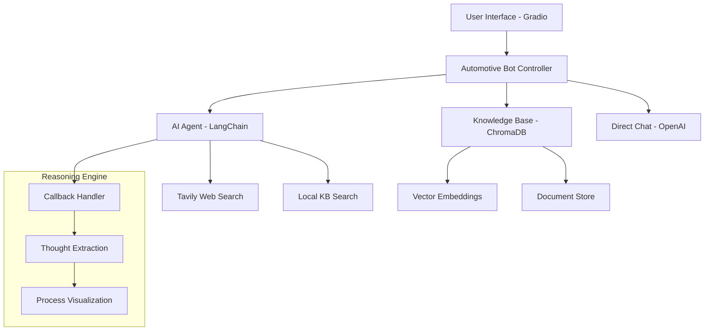

# 🚗 AI Automotive Consultant | Advanced RAG + Agent System

> **World-class automotive AI consultant with transparent reasoning, real-time web search, and intelligent fallback mech### User Interface

### Main Features
- **🚗 AI Automotive Consultant**: Primary chat interface with reasoning display and intelligent fallback
- **📚 Knowledge Base Manager**: Document upload, search capabilities, and database management

### Available Interfaces
The application provides multiple chatbot interfaces:

1. **AI Automotive Consultant** (Main): Advanced LangChain agent with web search and reasoning display
2. **Context-Aware Bot**: Multi-turn conversation with memory management
3. **Function Calling Bot**: OpenAI function calling for structured queries
4. **Simple FAQ Bot**: Basic FAQ responses without function calling

### Example Interactions
The interface shows:
- User queries and AI responses
- Reasoning process visualization (for agent mode)
- Source attribution and confidence indicators
- System status and capabilities
- Copy-to-clipboard functionality for responsesython](https://img.shields.io/badge/Python-3.11+-blue.svg)


## 🌟 Features

### 🧠 **Transparent AI Reasoning**
- **Thought Process Visualization**: See exactly how the AI thinks and reasons
- **Step-by-Step Analysis**: Observe each reasoning step in real-time
- **Tool Usage Transparency**: Monitor which tools are being used and why

### 🚀 **Intelligent Multi-Source Architecture**
```
User Query → Knowledge Base → AI Agent → Direct Chat
     ↓              ↓              ↓           ↓
   Input      Local Vector DB   Web Search   LLM Fallback
```

### 🔍 **Advanced Capabilities**
- **📚 Local Knowledge Base**: Specialized Audi & Honda information with ChromaDB
- **🌐 Real-time Web Search**: Latest automotive news via Tavily API
- **🤖 Smart Agent System**: Autonomous decision-making with LangChain agents
- **💬 Conversational Memory**: Context-aware multi-turn conversations
- **🔄 Intelligent Fallback**: Seamless transition between information sources

## 🏗️ Architecture

### Core Components



### Intelligent Fallback Chain

1. **🔍 Knowledge Base Search**: Query local vector database
2. **🤖 AI Agent Activation**: If KB fails → Activate web search agent
3. **💬 Direct Chat Fallback**: If agent fails → Use direct LLM chat

## 🚀 Quick Start

### Prerequisites
```bash
Python 3.8+
OpenAI API Key
Tavily API Key (for web search - optional)
4GB RAM (recommended)
2GB disk space for ChromaDB
```

### Installation

1. **Clone Repository**
```bash
git clone https://github.com/trongvanphan/faq_chatbot.git
cd faq_chatbot
```

2. **Install Dependencies**
```bash
# Create virtual environment (recommended)
python3 -m venv venv
source venv/bin/activate  # On Windows: venv\Scripts\activate

# Install required packages
pip install -r requirements.txt
```

3. **Environment Setup**
Create `.env` file:
```env
# OpenAI Configuration
OPENAI_API_KEY=your_openai_api_key
OPENAI_BASE_URL=https://api.openai.com/v1
MODEL_NAME=gpt-4o-mini
TEMPERATURE=0.5

# Embedding Configuration
EMBEDDING_KEY=your_openai_api_key
EMBEDDING_BASE_URL=https://api.openai.com/v1
EMBEDDING_MODEL=text-embedding-3-small

# Tavily Web Search
TAVILY_API_KEY=your_tavily_api_key
```

4. **Launch Application**
```bash
python app.py
```

## 🎯 Usage Examples

### Basic Automotive Queries
```
"So sánh Audi A4 với Honda Accord về tính năng an toàn"
→ Searches local knowledge base for detailed comparison
```

### Real-time News & Information
```
"Tin tức mới nhất về Tesla Model Y"
→ Activates web search agent for latest information
```

### Technical Consultations
```
"Bảo dưỡng định kỳ cho Honda Civic cần làm gì?"
→ Retrieves maintenance schedules from knowledge base
```

## 🧠 AI Reasoning Visualization

When the AI agent is activated, you'll see the complete reasoning process:

```
🧠 Quá trình suy nghĩ của Bot:

💭 Bước 1 - Suy nghĩ:
Tôi cần tìm kiếm thông tin về Tesla Model Y mới nhất...

🔧 Hành động: Sử dụng tool `tavily_search`
📝 Input: Tesla Model Y 2024 latest news

👀 Quan sát:
Found recent articles about Tesla Model Y updates...
```

## 📚 Knowledge Base Management

### Document Upload
- **Supported Formats**: PDF, TXT, Markdown
- **Auto Processing**: Automatic text chunking and embedding
- **Vector Storage**: ChromaDB with similarity search

### Search Capabilities
- **Semantic Search**: Understanding context and meaning
- **Metadata Filtering**: Advanced query capabilities
- **Real-time Statistics**: Monitor database performance

## 🔧 Technical Details

### Core Technologies
- **LangChain**: Agent orchestration and chain management
- **ChromaDB**: Vector database for embeddings
- **OpenAI Embeddings**: text-embedding-3-small model
- **Tavily API**: Real-time web search capabilities
- **Gradio**: Interactive web interface

### Performance Features
- **Conversation Memory**: ConversationBufferWindowMemory (last 5 exchanges)
- **Smart Caching**: Efficient embedding storage and retrieval
- **Error Handling**: Graceful fallbacks and error recovery
- **Token Management**: Optimized prompt and response handling

## 🎨 User Interface

### Main Features
- **🚗 AI Automotive Consultant**: Primary chat interface with reasoning display
- **📚 Knowledge Base Manager**: Document upload and search capabilities
- **📊 Real-time Statistics**: System performance monitoring

### Example Interactions
The interface shows:
- User queries and AI responses
- Reasoning process visualization
- Source attribution
- System status indicators

## 🔬 Advanced Features

### Callback System
Custom `AgentCallbackHandler` captures:
- **Thoughts**: AI reasoning steps
- **Actions**: Tool selections and usage
- **Observations**: Tool outputs and results

### Smart Context Management
- **Reference Resolution**: Understanding "it", "that car", etc.
- **Topic Tracking**: Maintaining conversation themes
- **Memory Optimization**: Efficient context window usage

## 🛠️ Development

### Project Structure
```
faq_chatbot/
├── app.py                          # Main Gradio interface with multiple tabs
├── automotive_bot.py               # Core AI consultant with LangChain agents
├── context_manager.py              # Multi-turn conversation and memory management
├── kb_manager.py                   # Knowledge base operations and ChromaDB integration
├── faq_bot.py                      # Function calling and legacy FAQ functionality
├── faq_data.py                     # Static data, function definitions, and FAQ content
├── requirements.txt                # Python dependencies
├── setup.sh                        # Automated setup script
├── .env                           # Environment configuration (create from .env.example)
├── chroma_db/                     # Vector database storage (auto-created)
├── docs/                          # Comprehensive documentation
│   ├── PROJECT_SUMMARY.md         # Complete project overview
│   ├── RAG_ARCHITECTURE.md        # RAG system technical details
│   ├── REASONING_GUIDE.md          # AI reasoning and transparency
│   ├── CONTEXT_MANAGEMENT_GUIDE.md # Conversation memory system
│   ├── FUNCTION_CALLING_GUIDE.md   # OpenAI function calling implementation
│   ├── TAVILY_SETUP.md            # Web search API setup
│   └── INSTALLATION.md            # Detailed installation guide
├── sample/                        # Sample automotive data files
│   ├── gia_xe_audi_2020_2025.txt
│   └── gia_xe_honda_2020_2025.txt
└── README.md                      # This documentation
```

### Key Classes
- **`AutomotiveBot`**: Main controller with LangChain agent integration and intelligent fallback
- **`AgentCallbackHandler`**: Custom callback handler for reasoning process capture and visualization
- **`ConversationManager`**: Multi-turn conversation memory and context management
- **`KnowledgeBaseManager`**: ChromaDB operations and document processing
- **`CustomOpenAIEmbeddings`**: Direct OpenAI embedding interface for vector operations
- **`CustomChromaRetriever`**: ChromaDB integration for LangChain retrieval chains

## 🤝 Contributing

1. Fork the repository
2. Create feature branch: `git checkout -b feature/amazing-feature`
3. Commit changes: `git commit -m 'Add amazing feature'`
4. Push to branch: `git push origin feature/amazing-feature`
5. Open Pull Request

## 📄 License

This project is licensed under the MIT License - see the [LICENSE](LICENSE) file for details.

## 🙏 Acknowledgments

- **LangChain** for the powerful agent framework
- **ChromaDB** for efficient vector storage
- **OpenAI** for embeddings and language models
- **Tavily** for real-time web search capabilities
- **Gradio** for the intuitive user interface

---

**Built with ❤️ for automotive enthusiasts and AI researchers**

*"Transparency in AI reasoning leads to trust and better decision-making"*
