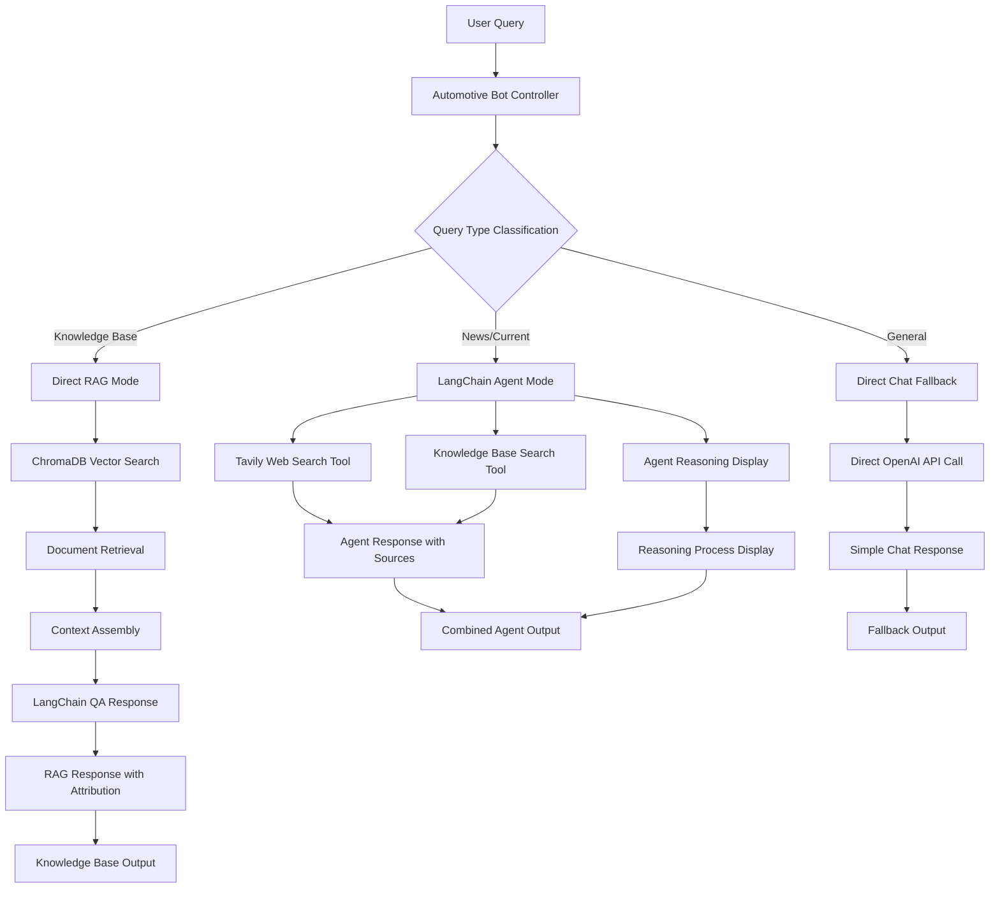

# 🚗 Advanced RAG Architecture Guide

## Overview
This document explains the sophisticated Retrieval-Augmented Generation (RAG) system powering the AI Automotive Consultant.

## Architecture Overview

## Architecture Overview



## Core Components

### 1. 🧠 Intelligent Query Classification

The system automatically determines the best response strategy based on query content:

```python
def get_automotive_response(user_input: str) -> str:
    """Smart routing based on query type and content"""
    
    # News/current events keywords
    news_keywords = [
        "tin tức", "news", "mới nhất", "latest", 
        "cập nhật", "update", "ra mắt", "launch",
        "đánh giá", "review", "thị trường", "market"
    ]
    
    # Check for news-related queries
    if any(keyword in user_input.lower() for keyword in news_keywords):
        return handle_agent_mode(user_input)  # Use LangChain agent
    
    # Try knowledge base first for specific information
    kb_response = try_knowledge_base_search(user_input)
    if kb_response and "không tìm thấy" not in kb_response.lower():
        return kb_response  # Direct RAG response
    
    # Fallback to agent mode for complex queries
    return handle_agent_mode(user_input)
```

### 2. 📚 ChromaDB Vector Store

```python
class CustomChromaRetriever(BaseRetriever):
    def _get_relevant_documents(self, query, run_manager=None):
        # Convert query to embedding
        query_embedding = self._embeddings.embed_query(query)
        
        # Similarity search in ChromaDB
        results = self._collection.query(
            query_embeddings=[query_embedding], 
            n_results=4
        )
        
        # Convert to LangChain Documents
        documents = []
        for i, doc in enumerate(results["documents"][0]):
            metadata = results["metadatas"][0][i]
            documents.append(Document(
                page_content=doc, 
                metadata=metadata
            ))
        return documents
```

### 3. 🤖 Intelligent Agent System

#### Tools Available:
- **Tavily Search**: Real-time web search for latest information
- **Knowledge Base Search**: Query local vector database
- **Direct Chat**: Fallback to base language model

#### Agent Configuration:
```python
agent = initialize_agent(
    tools=[tavily_search, kb_search],
    llm=self.llm,
    agent=AgentType.ZERO_SHOT_REACT_DESCRIPTION,
    verbose=True,
    handle_parsing_errors=True,
    max_iterations=3,
    callbacks=[reasoning_callback_handler]
)
```

### 4. 🔄 Intelligent Fallback Chain

The system implements a sophisticated three-tier fallback strategy:

#### Tier 1: Direct Knowledge Base Search
```python
def try_knowledge_base_search(query: str) -> Optional[str]:
    """First attempt: Search local ChromaDB"""
    try:
        retriever = CustomChromaRetriever(collection, embeddings)
        docs = retriever.get_relevant_documents(query)
        
        if docs and len(docs) > 0:
            # Found relevant documents, generate response
            return generate_rag_response(query, docs)
        return None
    except Exception as e:
        print(f"KB search failed: {e}")
        return None
```

#### Tier 2: LangChain Agent with Tools
```python
def handle_agent_mode(query: str) -> str:
    """Second attempt: Use LangChain agent with tools"""
    try:
        # Agent has access to both Tavily and KB search
        tools = [tavily_search_tool, kb_search_tool]
        agent = initialize_agent(
            tools=tools,
            llm=self.llm,
            agent=AgentType.ZERO_SHOT_REACT_DESCRIPTION,
            callbacks=[reasoning_callback_handler]
        )
        
        response = agent.run(query)
        reasoning = reasoning_callback_handler.get_thinking_process()
        
        return f"{reasoning}\n\n**🎯 Kết luận:**\n{response}"
    except Exception as e:
        print(f"Agent mode failed: {e}")
        return handle_direct_chat_fallback(query)
```

#### Tier 3: Direct Chat Fallback
```python
def handle_direct_chat_fallback(query: str) -> str:
    """Final fallback: Direct LLM chat"""
    try:
        response = openai_client.chat.completions.create(
            model=MODEL,
            messages=[
                {"role": "system", "content": automotive_system_prompt},
                {"role": "user", "content": query}
            ],
            temperature=TEMPERATURE
        )
        return f"💬 **Direct Chat:**\n{response.choices[0].message.content}"
    except Exception as e:
        return f"❌ Xin lỗi, tôi gặp lỗi kỹ thuật: {str(e)}"
```

```python
def intelligent_fallback(self, question: str):
    # Step 1: Try Knowledge Base
    kb_result = self.query_knowledge_base(question)
    
    if self.has_relevant_info(kb_result):
        return kb_result
    
    # Step 2: Try AI Agent
    if self.agent:
        try:
            return self.agent.run(question)
        except Exception:
            pass
    
    # Step 3: Direct Chat Fallback
    return self.direct_chat(question)
```

## Vector Database Design

### Document Processing Pipeline

```
Raw Document → Text Extraction → Chunking → Embedding → ChromaDB Storage
```

#### 1. Text Extraction
- **PDF**: PyPDF2 or similar libraries
- **TXT**: Direct text reading
- **Markdown**: Parse structure and content

#### 2. Intelligent Chunking
```python
def smart_chunk_text(text: str, chunk_size: int = 1000) -> List[str]:
    """
    Smart chunking that respects:
    - Sentence boundaries
    - Paragraph breaks
    - Section headers
    - Logical content units
    """
    # Implementation preserves semantic coherence
```

#### 3. Embedding Generation
- **Model**: text-embedding-3-small (OpenAI)
- **Dimensions**: 1536
- **Batch Processing**: Efficient API usage
- **Error Handling**: Retry mechanisms

#### 4. ChromaDB Storage
```python
collection.add(
    embeddings=embeddings,
    documents=chunks,
    metadatas=metadata_list,
    ids=unique_ids
)
```

### Metadata Schema

```json
{
    "source": "document_filename.pdf",
    "page": 15,
    "section": "Engine Specifications", 
    "chunk_id": "doc_001_chunk_015",
    "upload_date": "2024-07-12",
    "document_type": "manual",
    "vehicle_brand": "audi",
    "vehicle_model": "a4"
}
```

## Retrieval Strategies

### 1. Semantic Similarity Search
```python
# Find semantically similar content
results = collection.query(
    query_embeddings=[query_vector],
    n_results=4,
    where={"vehicle_brand": {"$in": ["audi", "honda"]}}
)
```

### 2. Hybrid Search (Future Enhancement)
- **Dense Retrieval**: Vector similarity
- **Sparse Retrieval**: Keyword matching  
- **Fusion**: Combine results with ranking

### 3. Contextual Re-ranking
- **Relevance Scoring**: Rate retrieved chunks
- **Diversity**: Avoid redundant information
- **Recency**: Prefer newer information when relevant

## LangChain Integration

### ConversationalRetrievalChain

```python
qa_chain = ConversationalRetrievalChain.from_llm(
    llm=self.llm,
    retriever=custom_retriever,
    memory=conversation_memory,
    combine_docs_chain_kwargs={
        "prompt": custom_prompt_template
    },
    return_source_documents=True
)
```

### Custom Prompt Template

```python
prompt_template = """
Bạn là chuyên gia tư vấn ô tô. Trả lời dựa trên thông tin sau:

Context: {context}
Chat History: {chat_history}
Question: {question}

Hướng dẫn:
- Trả lời bằng tiếng Việt, chi tiết và hữu ích
- Sử dụng thông tin từ context được cung cấp
- Nếu không có thông tin trong context, hãy nói rõ
- Duy trì tính nhất quán với cuộc hội thoại trước

Answer:
"""
```

### Memory Management

```python
memory = ConversationBufferWindowMemory(
    k=5,  # Keep last 5 exchanges
    memory_key="chat_history",
    return_messages=True,
    output_key="answer"
)
```

## Performance Optimization

### 1. Embedding Caching
```python
@lru_cache(maxsize=1000)
def get_cached_embedding(text: str) -> List[float]:
    return self.embedding_model.embed_query(text)
```

### 2. Batch Processing
```python
def batch_embed_documents(texts: List[str]) -> List[List[float]]:
    # Process multiple texts in single API call
    return self.embedding_model.embed_documents(texts)
```

### 3. Lazy Loading
- Load embeddings only when needed
- Stream large document processing
- Efficient memory usage

### 4. Vector Index Optimization
```python
# ChromaDB collection with optimized settings
collection = chroma_client.create_collection(
    name="automotive_knowledge",
    embedding_function=embedding_function,
    metadata={"hnsw:space": "cosine"}  # Optimized for similarity search
)
```

## Quality Assurance

### 1. Relevance Scoring
```python
def calculate_relevance_score(query: str, document: str) -> float:
    """
    Calculate how relevant a document is to the query
    using multiple factors:
    - Semantic similarity
    - Keyword overlap
    - Context coherence
    """
```

### 2. Source Attribution
```python
def format_sources(sources: List[Document]) -> str:
    formatted = "📚 **Nguồn:**\n"
    for i, source in enumerate(sources, 1):
        metadata = source.metadata
        formatted += f"{i}. {metadata.get('source', 'Unknown')} "
        formatted += f"(Page {metadata.get('page', 'N/A')})\n"
    return formatted
```

### 3. Response Validation
- Check for hallucination indicators
- Verify information consistency
- Monitor response quality metrics

## Monitoring & Analytics

### 1. Query Analytics
```python
def log_query_metrics(query: str, response_time: float, 
                     sources_found: int, user_satisfaction: float):
    """Track system performance and user satisfaction"""
```

### 2. Vector Database Stats
```python
def get_kb_statistics():
    return {
        "total_documents": collection.count(),
        "storage_size": get_db_size(),
        "query_performance": get_avg_query_time(),
        "hit_rate": calculate_hit_rate()
    }
```

### 3. A/B Testing Framework
- Test different retrieval strategies
- Compare embedding models
- Optimize chunk sizes and overlap

## Future Enhancements

### 1. Advanced RAG Techniques
- **GraphRAG**: Knowledge graph integration
- **Self-RAG**: Self-correcting retrieval
- **Adaptive RAG**: Dynamic strategy selection

### 2. Multi-Modal Support
- **Image Processing**: Car photos and diagrams
- **Video Content**: Maintenance tutorials
- **Audio Processing**: Voice queries

### 3. Personalization
- **User Profiles**: Personalized recommendations
- **Learning**: Adapt to user preferences
- **Context**: Remember user's vehicle history

---

*This RAG architecture provides a robust foundation for intelligent automotive consultation with transparency and accuracy.*
