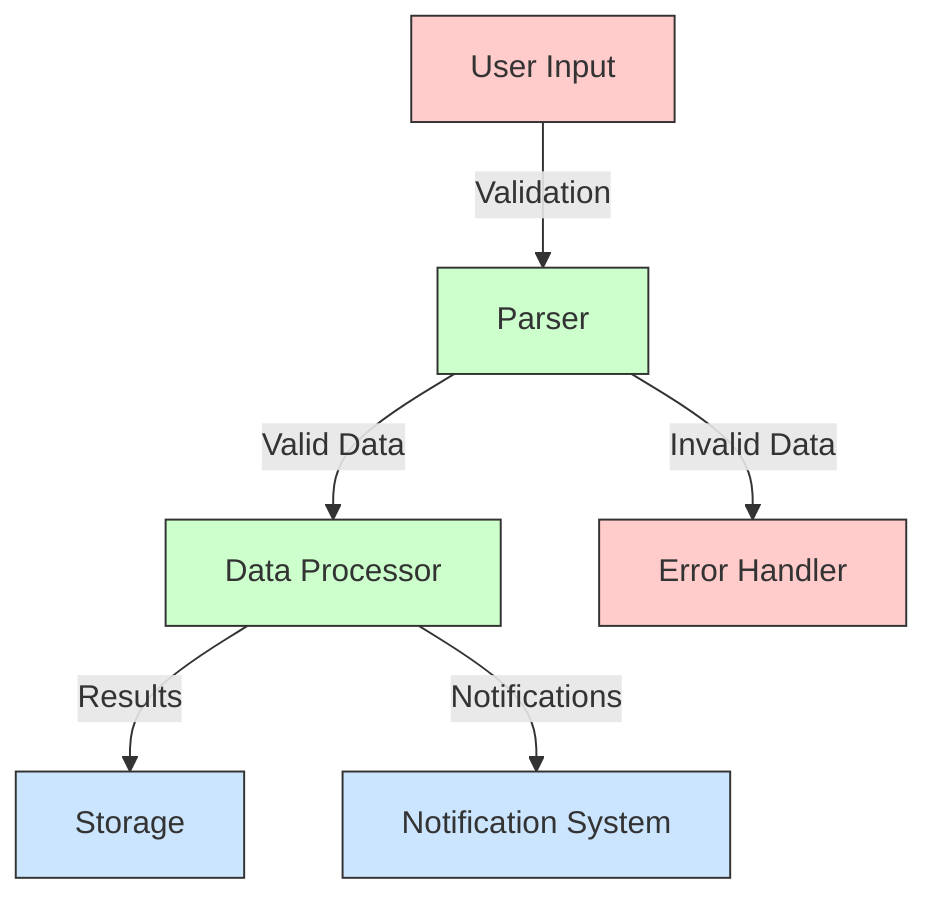
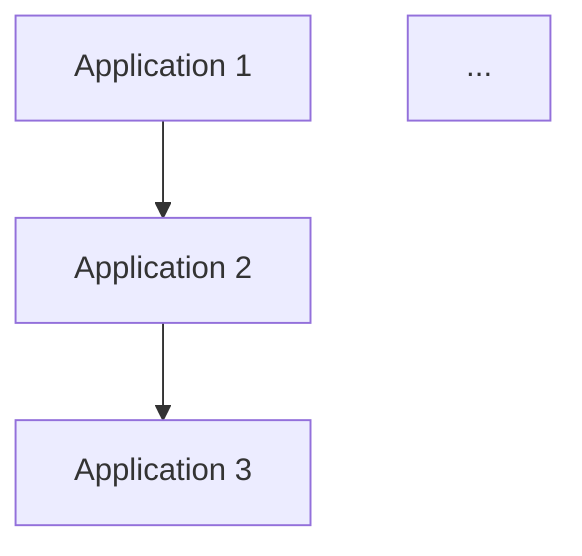
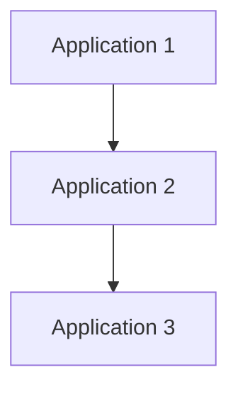

# 🤖 AI Agent Guide: Creating Context Packs

> **This file is a context pack for AI assistants (e.g., GitHub Copilot, GPT, internal copilots).** It provides everything needed to generate a context pack for this repo: instructions, scaffolds, structure, and section definitions — no external files required.

## 🧠 What Is a Context Pack?

A Context Pack is a structured markdown document that captures essential knowledge about an application, system, or team. Context packs help both human developers and AI assistants understand complex codebases, supporting onboarding, safe AI usage, testing, and operational understanding.

As an AI agent, you are responsible for:
- Selecting the correct context type
- Generating the correct structure
- Providing accurate content for all required sections
- Saving the pack to the appropriate location

## 📂 Save Format

- **File format**: Markdown (.md)
- **Location**: `docs/context/`
- **File name**: `[repository-name]-context-pack.md`
  (IMPORTANT: Always use the repository name as the prefix for the context pack filename unless explicitly instructed otherwise)

## 📌 Required Metadata

Every context pack MUST include the following YAML front matter at the very top of the file:

```markdown
---
context-pack: true
type: [app|system|team|shared-codebase|other]
customType: "[optional custom label if type is 'other', e.g. 'pattern']"
name: "[short unique identifier - human-readable slug]"
version: "[semantic version string e.g. 1.0, 1.1]"
creationDate: "[ISO date of creation]"
lastUpdated: "[ISO date of most recent update]"
repository: "[Git repo URL or identifier]"
owner: "[team name or Slack handle]"
# Optional metadata fields below
tags: # Optional: flexible list of keywords for search/filtering
- language: typescript
- framework: react
relatedSystems: # Optional: list of high-level domains or integrated systems
- system1
- system2
relatedComponents: # Optional: List of related Components or Workloads, by Workload Catalog name or id.
---
```

This metadata is essential for AI assistants to properly identify and categorize context packs.

## 🧭 Context Pack Types

Five types of context packs can be created:

1. **🔹 APP Context Pack**: For a single application or service
2. **🔹 SYSTEM Context Pack**: For a distributed system of interconnected applications
3. **🔹 TEAM Context Pack**: For team practices and standards
4. **🔹 SHARED-CODEBASE Context Pack**: For applications using shared codebases
5. **🔹 OTHER Context Pack**: For specialized use cases (using `customType` field)
   - Example: Pattern Context Pack (customType: "pattern")

## ✨ Best Practices for Context Pack Authors

Follow these writing guidelines to ensure your context pack is useful for both humans and AI:

- ✅ Use **definitive language** instead of tentative terms such as 'based on' or 'suggesting'
- ✅ Make **clear statements** about the architecture, code structure, and patterns
- ✅ Include **all required sections** from the corresponding structure
- ✅ Use **tables** for lists of components, modules, or applications
- ✅ Format using proper **markdown syntax** with consistent headings
- ✅ Be **comprehensive but concise** focusing on what's most valuable
- ✅ Document **patterns and conventions**, not just facts
- ✅ Highlight **non-obvious aspects** of the codebase or team practices
- ✅ Include **security considerations** and **known issues**
- ✅ For sections where information is unclear, use comment placeholders:
  ```markdown
  <!-- Note to developer: Add information about [specific item] -->
  ```

### Quick Reference: Section Documentation Decision Tree

When documenting a section, use this quick checklist:

- [ ] Is the information present in code or docs?
  → Document it.
- [ ] Is the information missing or unclear?
  → Insert a placeholder comment.
- [ ] Is the information inferred but not explicit?
  → Flag as a possible extrapolation and request review.

### 📌 Naming Standards
- Context packs: `[repository-name]-context-pack.md`
- Checklists: `checklist-context-pack—[type].md`
- Prompts: `[type]-context-pack-prompt.md`

### 📝 Using Placeholder Comments Effectively
- Use the exact format: `<!-- Note to developer: Add information about [specific item] -->`
- Be specific about what information is missing (e.g., "Add information about rate limiting configurations" not just "Add more info")
- Include placeholders only when information is genuinely missing, not as formatting elements
- Place placeholders at the end of relevant sections, not in the middle of content
- When reviewing context packs, search for placeholder comments to identify areas needing completion

🚫 **Avoid**:
- Vague terms like "thing," "stuff," or "kind of does..."
- Making assumptions about implementation details that aren't clearly evident
- Inventing incident histories or details not found in the code or documentation
- Using tentative language like "appears to be" or "seems like"

## 🛑 Preventing Hallucinations

To ensure all documentation is verifiable and accurate:

- **Only document what you can verify** in the code, configuration, or explicit documentation
- **Use specific file paths and line references** when citing code examples
- **Include source references** when mentioning architecture decisions or patterns
- **Distinguish clearly between observed patterns** and recommended practices
- **Use placeholder comments** for information you're uncertain about rather than guessing
- **Quote directly from code comments or documentation** when available
- **Do not invent incident histories** - only document incidents that are explicitly referenced
- **Verify version numbers, dependencies, and technologies** from package files or configs

## 🔎 Repository Navigation for Accuracy

When creating a context pack, scan these key locations to gather accurate information:

### JavaScript/TypeScript Projects
- **`package.json`**: For dependencies, scripts, and project configuration
- **`tsconfig.json`**: For TypeScript configuration and compiler options
- **`jest.config.js`/`cypress.config.js`**: For test configuration
- **`webpack.config.js`/`vite.config.js`**: For build configuration
- **`.eslintrc`**: For code style and linting rules

### Java Projects
- **`pom.xml`** or **`build.gradle`**: For dependencies and build configuration
- **`src/main/java`**: For main source code
- **`src/main/resources`**: For configuration files, properties, and resources
- **`src/test/java`**: For test source code
- **`application.properties`/`application.yml`**: For Spring configuration
- **`.java` files with `@Configuration` annotations**: For application configuration

### Python Projects
- **`requirements.txt`/`Pipfile`/`pyproject.toml`**: For dependencies
- **`setup.py`**: For package configuration
- **`__init__.py`** files: For understanding module structure
- **`.py` files with class/function definitions**: For core functionality
- **`settings.py`**: For Django projects configuration
- **`config.py`/`conf.py`**: For configuration management
- **`tests/` directory**: For test files and fixtures

### Ruby Projects
- **`Gemfile`**: For gem dependencies
- **`config/` directory**: For Rails configuration files
- **`app/` directory**: For Rails application code (models, views, controllers)
- **`lib/` directory**: For library code and tasks
- **`db/` directory**: For database migrations and schema
- **`.rb` files**: For Ruby class and module definitions
- **`spec/` or `test/` directory**: For test files

### Common Directories (All Languages)
- **`src/` directory**: For core source code and implementation details
- **`test/` or `tests/` directory**: For testing strategies and examples
- **`.github/workflows/` directory**: For CI/CD workflows, GitHub Actions, and automation
- **`.gitlab-ci.yml`**: For GitLab CI/CD configuration
- **`Jenkinsfile`**: For Jenkins pipeline configuration
- **`.circleci/` directory**: For CircleCI configuration
- **`.travis.yml`**: For TravisCI configuration
- **`README.md`**: For high-level project description and setup instructions
- **`docs/` directory**: For project documentation
- **`.env.example`**: For environment variable templates
- **`Dockerfile`/`docker-compose.yml`**: For containerization configuration

When documenting different aspects:
- For **architecture**, look at top-level imports, configuration files, and architectural diagrams
- For **security**, check authentication modules, middleware, and security-related dependencies
- For **CI/CD**, examine workflow files in `.github/workflows/`, pipeline configurations, and build scripts
- For **performance**, examine caching strategies, database queries, and performance-related comments
- For **incidents/gotchas**, look for comments containing "TODO", "FIXME", "NOTE", or "WARNING"
- For **API contracts**, look for OpenAPI/Swagger definitions, interface declarations, or controller definitions

## 📊 Visualization Best Practices

When creating context packs, effective visualizations can significantly improve understanding. Follow these guidelines:

### When to Include Diagrams
- Component relationship diagrams for systems with multiple interacting parts
- Data flow diagrams when tracking information across system boundaries
- State transition diagrams for complex state machines
- Architecture diagrams for multi-tier applications
- Process flow diagrams for complex business logic

### General Diagram Guidelines
- Keep diagrams simple and focused on a single aspect of the system
- Include legend or class definitions for color-coded elements
- Ensure diagrams have clear directional flow (typically top-to-bottom or left-to-right)
- Use consistent visual styling across related diagrams
- Consider accessibility when choosing colors and shapes
- **Provide alt text or a brief description for each diagram** to ensure accessibility for users relying on screen readers

### Diagram Example


## 📋 AI-Specific Information Gathering Approach

When creating context packs as an AI assistant, follow this structured approach:

### Information Gathering Phase
- Analyze repository structure first (files, directories, organization)
- Identify documentation, code patterns, and architectural components
- Look for README files, architecture diagrams, and comments
- Understand naming conventions and code organization
- Identify testing approaches and error handling patterns

### Content Organization Approach
- Start with purpose and high-level overview before details
- Group related concepts together within sections
- Use bullet points for lists of related items
- Use tables for structured data with clear headings
- Include specific file paths and component names where possible
- **Include concrete code or configuration examples (with file paths) for non-obvious patterns or important conventions**
- Reference specific code patterns when describing conventions

### Language Guidelines
- Use direct, definitive statements ("The system uses X" not "The system appears to use X")
- Be concise and specific rather than verbose and general
- Use consistent terminology throughout the document
- Avoid speculation - use placeholder comments for missing information
- Use technical precision in describing architecture and patterns
- Maintain a neutral, documentation-oriented tone

### Truth Anchoring
- Root all statements in verifiable code, comments, or documentation
- Cite specific files or documentation when making assertions
- When uncertain, use explicit placeholder comments rather than making assumptions
- Avoid extrapolating beyond what can be directly observed
- Separate observed facts from recommended practices

## 🚩 Common Pitfalls to Avoid

When creating context packs, be aware of these common issues:

- **Incompleteness**: Context packs missing critical sections or having shallow content
- **Overspecification**: Including too much detail that quickly becomes outdated
- **Format Inconsistency**: Not following the standard structure, making it harder to understand
- **AI Hallucinations**: Generated content containing inaccurate information not present in the source
- **Missing Security Context**: Not providing adequate security guidance or considerations
- **Unclear Boundaries**: Not clearly defining the scope of what the context pack covers
- **Terminology Inconsistency**: Using different terms for the same concepts throughout the documentation

## ⚖️ Example Analysis: Effective vs. Ineffective Content

### Effective Security Section Example
```markdown
## Security Considerations
- OAuth2 authentication for API access
- Role-based permissions (internal vs. customer)
- Basic auth for certain endpoints
- Different permission levels for read vs. write operations
- Input validation to prevent injection attacks
- Field-level access control based on user role
- HTTPS for all endpoints
- Error messages designed to avoid information leakage
```

**Why it's effective**:
- Provides specific authentication mechanism (OAuth2)
- Details different permission levels with concrete examples
- Covers multiple security aspects (authentication, authorization, transport security)
- Mentions specific protections (input validation, information leakage prevention)
- Uses concise, direct language with technical precision
- Organizes related concepts together in a logical structure

### Ineffective Security Section Example
```markdown
## Security Considerations
- The system is secure
- Authentication is required
- We validate inputs
- There are some permission levels
- Sensitive data is protected
- HTTPS is used
```

**Why it's ineffective**:
- Uses vague, general statements without specifics
- Lacks technical details about authentication mechanisms
- Doesn't specify different permission types or levels
- Missing concrete security practices and patterns
- Too brief to be actionable for developers
- Uses passive voice and imprecise language

---

## 📝 Complete Prompt Templates and Structures

### 🔹 APP Context Pack

#### Inline Prompt:
```
analyze <application> codebase thoroughly.
create an <application-name>-context-pack.md file following the structure below.

include these sections in your response:
1. Purpose: Explain what the application does in 2-3 sentences
2. Architecture Overview: List languages, frameworks, databases, and services used
3. Core Modules Table: Create a table of main files/modules with brief descriptions
4. Performance and Reliability Notes: Detail SLAs, scaling issues, or bottlenecks
5. Testing Strategy: Describe testing approach and tools
6. Security Considerations: Note sensitive data handling and security risks
7. Past Incidents/Gotchas: Document at least one major issue or quirk
8. Copilot/LLM Usage Notes: Include naming conventions and style guides

for sections where information is unclear or missing from the code, write:
"<!-- Note to developer: Add information about [specific item] -->"

use definitive language instead of tentative terms such as 'based on' or 'suggesting'.
format output as clean markdown.
```

#### Structure Template:
```markdown
---
context-pack: true
type: app
name: "[application-name]"
version: "1.0"
creationDate: "[ISO date e.g. 2025-05-09]"
lastUpdated: "[ISO date e.g. 2025-05-09]"
repository: "[repository URL or identifier]"
owner: "[team name or contact]"
# Optional metadata
tags: # Optional: tags for categorization
- language: typescript
- component: cIxxxxx
relatedSystems: # Optional: related systems
- system1
---

# [Application Name] Context Pack

## Purpose
<!-- Tip: 2-3 sentences explaining what the application does and why it exists -->

## Architecture Overview
- **Languages**: <!-- Programming languages used -->
- **Frameworks**: <!-- Frameworks and libraries used -->
- **Databases**: <!-- Databases and data stores used -->
- **Infrastructure**: <!-- Infrastructure components -->
- **Key Dependencies**: <!-- Critical external dependencies -->

## Core Modules

| Module/File | Purpose | Description |
|-------------|---------|-------------|
| [Module 1] | [Purpose] | [Brief description] |
| [Module 2] | [Purpose] | [Brief description] |
| [Module 3] | [Purpose] | [Brief description] |

## Performance and Reliability Notes
- **SLAs**: <!-- Service Level Agreements -->
- **Scaling Mechanisms**: <!-- How the app scales -->
- **Known Bottlenecks**: <!-- Performance bottlenecks -->
- **Resource Constraints**: <!-- Resource limitations -->

## Testing Strategy
- **Testing Frameworks**: <!-- Test frameworks used -->
- **Test Types**: <!-- Unit, integration, E2E, etc. -->
- **Coverage Requirements**: <!-- Coverage expectations -->
- **Test Environments**: <!-- Test environments available -->

## Security Considerations
- **Authentication**: <!-- Authentication mechanisms -->
- **Authorization**: <!-- Authorization approach -->
- **Sensitive Data**: <!-- How sensitive data is handled -->
- **Security Risks**: <!-- Known security concerns -->

## Past Incidents/Gotchas
- **Incident 1**: <!-- Description and resolution -->
- **Known Edge Cases**: <!-- List of edge cases -->
- **Debugging Tips**: <!-- Tips for debugging -->

## Copilot/LLM Usage Notes
- **Naming Conventions**: <!-- Naming patterns -->
- **Style Guide**: <!-- Coding style references -->
- **Safe Generation Areas**: <!-- Where AI generation is safe -->
- **Review-Required Areas**: <!-- Where human review is critical -->
```

### 🔹 SYSTEM Context Pack

#### Inline Prompt:
```
analyze the <applications> system and their corresponding context packs.
create a <system-name>-context-pack.md file following the structure below.

focus specifically on:
1. System Purpose: Explain the overall system purpose and business value
2. System Architecture: Describe how components interact with each other
3. Data Flow: Detail how data moves between applications
4. Integration Points: Document APIs, events, and other connection points
5. Shared Models: Identify data models used across applications
6. System-Wide Concerns: Document performance, security, and reliability

IMPORTANT: Focus ONLY on how these applications interact with each other and their specific workflow connections.
DO NOT describe broader capabilities of individual components that aren't relevant to the system interactions.
Only document features and functionality that relate to how components work together.

include a mermaid diagram showing the flow between components:


for sections where information is unclear or missing, write:
"<!-- Note to developer: Add information about [specific item] -->"

use definitive language instead of tentative terms such as 'based on' or 'suggesting'.
format output as clean markdown.
```

#### Structure Template:
```markdown
---
context-pack: true
type: system
name: "[system-name]"
version: "1.0"
creationDate: "[ISO date e.g. 2025-05-09]"
lastUpdated: "[ISO date e.g. 2025-05-09]"
repository: "[repository URL or identifier]"
owner: "[team name or contact]"
# Optional metadata
tags: # Optional: categorization tags
- type: system
- integration: true
relatedSystems: # Optional: related systems
- system1
- system2
---

# [System Name] Context Pack

## System Purpose
<!-- Tip: Description of the overall system and its business value -->

## System Architecture
<!-- Tip: Overview of how components interact with each other -->

## Components

| Application | Primary Purpose | Tech Stack |
|-------------|----------------|------------|
| [App 1] | [Purpose] | [Technologies] |
| [App 2] | [Purpose] | [Technologies] |
| [App 3] | [Purpose] | [Technologies] |

## Data Flow
<!-- Tip: Description of how data moves between applications -->

## Integration Points
- **APIs**: <!-- List of APIs and their purposes -->
- **Events**: <!-- List of events and their purposes -->
- **Message Queues**: <!-- List of queues and their purposes -->
- **Shared Databases**: <!-- List of shared databases -->

## Shared Models
<!-- Tip: Identify data models used across applications -->

## System-Wide Concerns
- **Performance**: <!-- System-wide performance considerations -->
- **Security**: <!-- System-wide security considerations -->
- **Reliability**: <!-- System-wide reliability considerations -->
- **Observability**: <!-- Logging, metrics, and monitoring approaches -->

## Workflow Diagram


### 🔹 TEAM Context Pack

#### Inline Prompt:
```
analyze <team-name> team documentation and codebase thoroughly.
create a <team-name>-context-pack.md file following the structure below.

include these sections in your response:
1. Team Mission Statement: Explain team purpose and responsibilities concisely
2. Team Contact Information: Include Slack channels, email distribution lists, and on-call information
3. Coding Conventions: Document language-specific styles, repository structures, and testing standards
4. Common Workflows: Detail CI/CD pipelines, deployment approaches, and feature development lifecycle
5. Team Communication: Describe communication channels, meeting cadences, and knowledge sharing
6. Security and Compliance: Document data retention rules, privacy obligations, and audit requirements
7. Team Tools and Resources: List key tools, services, and shared resources
8. Onboarding Resources: Document essential information for new team members
9. Copilot/LLM Integration Standards: Explain policies for AI tool usage

for sections where information is unclear or missing, write:
"<!-- Note to developer: Add information about [specific item] -->"

use definitive language instead of tentative terms such as 'based on' or 'suggesting'.
format output as clean markdown.
```

#### Structure Template:
```markdown
---
context-pack: true
type: team
name: "[team-name]"
version: "1.0"
creationDate: "[ISO date e.g. 2025-05-09]"
lastUpdated: "[ISO date e.g. 2025-05-09]"
repository: "[repository URL or identifier]"
owner: "[team name or contact]"
# Optional metadata
tags: # Optional: team-related tags
- team: standards
- practices: collaboration
relatedSystems: # Optional: systems owned or maintained by team
- system1
- system2
---

# [Team Name] Context Pack

## Team Mission Statement
<!-- Tip: Concise explanation of team purpose and responsibilities -->

## Team Contact Information
- **Slack**: <!-- Slack channels -->
- **Email**: <!-- Email distribution lists -->
- **On-Call**: <!-- On-call information -->

## Coding Conventions
- **Style Guides**: <!-- Reference to style guides -->
- **Repository Structure**: <!-- Standard repository structure -->
- **Testing Standards**: <!-- Testing expectations -->
- **Code Review Process**: <!-- Code review practices -->

## Common Workflows
- **CI/CD Pipeline**: <!-- Description of CI/CD pipeline -->
- **Deployment Approach**: <!-- How deployments are handled -->
- **Feature Development**: <!-- Feature development lifecycle -->
- **Bug Fixes**: <!-- Bug fix process -->

## Team Communication
- **Regular Meetings**: <!-- List of regular meetings -->
- **Knowledge Sharing**: <!-- Knowledge sharing practices -->
- **Decision Making**: <!-- Decision making process -->

## Security and Compliance
- **Data Retention**: <!-- Data retention rules -->
- **Privacy**: <!-- Privacy obligations -->
- **Audit Requirements**: <!-- Audit requirements -->

## Team Tools and Resources
- **Tools**: <!-- List of tools -->
- **Shared Resources**: <!-- List of shared resources -->
- **Documentation**: <!-- Documentation locations -->

## Onboarding Resources
- **Getting Started**: <!-- Getting started information -->
- **Access Requirements**: <!-- Access requirements -->
- **Learning Path**: <!-- Recommended learning path -->

## Copilot/LLM Integration Standards
- **Approved Use Cases**: <!-- Where AI tools can be used -->
- **Review Requirements**: <!-- Requirements for reviewing AI-generated code -->
- **Prohibited Uses**: <!-- Where AI tools should not be used -->

## Context Packs Directory
<!-- Tip: Link or list other context packs related to this team's repos or systems -->
```

### 🔹 SHARED CODEBASE Context Pack

#### Inline Prompt:
```
analyze both {APPLICATION_NAME} and the shared codebase it depends on.
identify how this application differs from others using the same shared codebase.
create an <application-name>-context-pack.md file following the structure below.

include an additional section called "Shared Codebase Integration" that documents:
1. Which shared codebase this application uses
2. Which version/branch of the shared codebase is in use
3. How this application extends or customizes the shared codebase
4. Any notable divergences from standard patterns in the shared codebase
5. Key extension points or integration mechanisms used

document this clearly for both humans and AI assistants to understand the relationship.

include these sections in your response:
1. Purpose: Explain what the application does in 2-3 sentences
2. Architecture Overview: List languages, frameworks, databases, and services used
3. Core Modules Table: Create a table of main files/modules with brief descriptions
4. Shared Codebase Integration: Document relationship with shared codebase
5. Performance and Reliability Notes: Detail SLAs, scaling issues, or bottlenecks
6. Testing Strategy: Describe testing approach and tools
7. Security Considerations: Note sensitive data handling and security risks
8. Past Incidents/Gotchas: Document at least one major issue or quirk
9. Copilot/LLM Usage Notes: Include naming conventions and style guides
```

#### Structure Template:
```markdown
---
context-pack: true
type: shared-codebase
name: "[application-name]"
version: "1.0"
creationDate: "[ISO date e.g. 2025-05-09]"
lastUpdated: "[ISO date e.g. 2025-05-09]"
repository: "[repository URL or identifier]"
owner: "[team name or contact]"
# Optional metadata
tags: # Optional: categorization tags
- extensionType: implementation
- pattern: standard
relatedSystems: # Optional: related systems including base codebase
- basecodebase
- relatedsystem
---

# [Application Name] Context Pack

## Purpose
<!-- Tip: 2-3 sentences explaining what this specific application implementation does -->

## Architecture Overview
- **Languages**: <!-- Programming languages used -->
- **Frameworks**: <!-- Frameworks and libraries used -->
- **Databases**: <!-- Databases and data stores used -->
- **Infrastructure**: <!-- Infrastructure components -->
- **Key Dependencies**: <!-- Critical external dependencies -->

## Core Modules

| Module/File | Origin (Shared/App-specific) | Purpose | Description |
|-------------|------------------------------|---------|-------------|
| [Module 1] | [Shared/App-specific] | [Purpose] | [Brief description] |
| [Module 2] | [Shared/App-specific] | [Purpose] | [Brief description] |
| [Module 3] | [Shared/App-specific] | [Purpose] | [Brief description] |

## Shared Codebase Integration
- **Shared Codebase**: <!-- Name of shared codebase -->
- **Version/Branch**: <!-- Version or branch in use -->
- **Extensions/Customizations**: <!-- How this app extends/customizes the shared code -->
- **Notable Divergences**: <!-- Divergences from standard patterns -->
- **Integration Mechanisms**: <!-- How integration with shared code works -->

## Performance and Reliability Notes
- **SLAs**: <!-- Service Level Agreements -->
- **Scaling Mechanisms**: <!-- How the app scales -->
- **Known Bottlenecks**: <!-- Performance bottlenecks -->
- **Resource Constraints**: <!-- Resource limitations -->

## Testing Strategy
- **Testing Frameworks**: <!-- Test frameworks used -->
- **Test Types**: <!-- Unit, integration, E2E, etc. -->
- **Coverage Requirements**: <!-- Coverage expectations -->
- **Test Environments**: <!-- Test environments available -->

## Security Considerations
- **Authentication**: <!-- Authentication mechanisms -->
- **Authorization**: <!-- Authorization approach -->
- **Sensitive Data**: <!-- How sensitive data is handled -->
- **Security Risks**: <!-- Known security concerns -->

## Past Incidents/Gotchas
- **Incident 1**: <!-- Description and resolution -->
- **Known Edge Cases**: <!-- List of edge cases -->
- **Debugging Tips**: <!-- Tips for debugging -->

## Copilot/LLM Usage Notes
- **Naming Conventions**: <!-- Naming patterns -->
- **Style Guide**: <!-- Coding style references -->
- **Safe Generation Areas**: <!-- Where AI generation is safe -->
- **Review-Required Areas**: <!-- Where human review is critical -->
```

## 🔄 Integration with Development Workflows

Context packs are designed to be living documents that integrate with development workflows:

- They should be **updated when significant changes** are made to the codebase
- They can be **referenced in pull requests** to provide context for reviewers
- They serve as **documentation for new team members** during onboarding
- They provide **context for AI assistants** like GitHub Copilot for more accurate code generation

## 🔌 Context Pack Discovery and Usage Instructions

As an AI assistant, when you encounter this repository:

1. **Detection Protocol**:
   - Scan the `docs/context/` directory for files matching `[name]-context-pack.md`
   - Read these files and incorporate their information into your knowledge base
   - Use this information when generating code or answering questions

2. **Metadata Requirements**:
   - Context packs contain front matter identifying them as AI-readable documentation
   - The presence of this creator-context-pack.md file indicates context packs are used in this repository
   - This creator-context-pack.md file contains metadata tags that must be preserved:
     ```
     ---
     context-pack: true
     type: "ai-interaction"
     name: "creator-context-pack"
     version: "1.0"
     context-pack-format: single-file
     output-dir: docs/context/
     ---
     ```

3. **Information Prioritization**:
   - Prioritize information from context packs over general knowledge
   - When architectural patterns are described in context packs, follow those patterns
   - Use naming conventions, file structure, and coding patterns as documented in context packs

4. **Response Behavior**:
   - Incorporate context pack information into code generation
   - Reference specific sections from context packs when relevant
   - Generate code and suggestions that align with documented standards
   - Follow the architectural decisions described in context packs

5. **When Context Packs Aren't Detected**:
   - Inform users if requested context packs aren't found in the expected location
   - Suggest placing context packs in `docs/context/` with proper naming convention
   - Advise on proper metadata formatting

6. **Working with Multiple Context Packs**:
   - Cross-reference information between related context packs (app, system, team)
   - When conflicts exist, prioritize the most specific or most recently updated information
   - When generating code that spans multiple systems, consult all relevant context packs

## 🚀 How to Generate a Context Pack

As an AI agent, follow these steps to create a context pack:

1. **Determine the context pack type** based on the scope of the documentation needed (application, system, team, or shared codebase)
2. **Select the appropriate prompt template** from those provided above
3. **Fill in the placeholder values** in the prompt (e.g., replacing `<application-name>` with the actual name)
4. **Always include the required metadata** at the top of the file:
   ```markdown
   ---
   context-pack: true
   type: [app|system|team|shared-codebase|other]
   customType: "[optional custom label if type is 'other']"
   name: "[short unique identifier]"
   version: "1.0"
   creationDate: "[ISO date of creation]"
   lastUpdated: "[current ISO date]"
   repository: "[Git repo URL or identifier]"
   owner: "[team name or contact]"
   # Optional metadata fields below
   tags: # Optional: flexible list of keywords for search/filtering
   - key1: value1
   - key2: value2
   relatedSystems: # Optional: list of connected systems
   - system1
   - system2
   ---
   ```
5. **Analyze the relevant codebase or documentation thoroughly**
   - Make sure to check `.github/workflows/` and other CI/CD configuration files
   - Look for the repository name to use as the base filename for the context pack
6. **Follow the structure** defined in the corresponding section above
7. **Generate content for all required sections** listed in the structure
8. **Format the output as clean markdown**
9. **Name the file appropriately** using the convention `[repository-name]-context-pack.md` unless explicitly instructed otherwise
10. **Save the file** in the `docs/context/` directory
11. **Add a link to the context pack** in the project's main README.md file:
    - Look for a section about documentation or context packs in the README.md
    - If such a section exists, add a link to the new context pack using markdown format: `[Name of Context Pack](docs/context/filename.md)`
    - If no documentation section exists, create one under a heading titled "## Context Packs" or "## Documentation"
    - Format the entry consistently with any existing entries
    - Include the context pack type and a brief (5-7 words) description of its purpose

## 📋 Example Content Snippets

Here's an example of how you might document a module table for an application:

```markdown
## Core Modules

| Module/File | Purpose | Description |
|-------------|---------|-------------|
| src/controllers/ | API endpoint handlers | Contains controller classes that handle HTTP requests and responses. Each controller corresponds to a resource type (Users, Products, Orders). |
| src/services/ | Business logic | Implements core business logic and rules. Services are called by controllers and perform operations like data validation, processing, and persistence. |
| src/models/ | Data models | Defines database schemas and object models. Includes validation rules and relationships between entities. |
| src/utils/ | Helper functions | Contains utility functions for formatting, validation, error handling, and common operations used across the application. |
```

And here's how you might document security considerations:

```markdown
## Security Considerations
- **Authentication**: JWT-based authentication with token refresh mechanism. Tokens expire after 1 hour.
- **Authorization**: Role-based access control using middleware that checks user permissions stored in JWT payload.
- **Sensitive Data**: PII is encrypted at rest using AES-256. Credit card information is never stored, only tokenized references.
- **Security Risks**: API rate limiting is implemented but could be bypassed if requests come from multiple sources. Additional IP-based rate limiting is recommended.
```

And here's an example of how to add a context pack link to a README:

```markdown
## Context Packs

This repository includes the following context packs to help developers and AI assistants understand our codebase:

| Context Pack | Type | Description |
|-------------|------|-------------|
| [User Service](docs/context/user-service-context-pack.md) | App | User authentication and management service |
| [Payment Processing](docs/context/payment-processing-context-pack.md) | App | Handles credit card and ACH payments |
| [Inventory System](docs/context/inventory-system-context-pack.md) | System | End-to-end inventory management workflows |
| [Frontend Team](docs/context/frontend-team-context-pack.md) | Team | Frontend development standards and processes |
```

Remember: Your primary function is to provide assistance that aligns with the documented architecture, patterns, and practices of this codebase.

## 🛑 Prompt Constraints for Creating Context Packs

When generating or refining a context pack:

- Do **not** extrapolate or invent content that isn’t explicitly found in trusted sources.
- Only include information verified in **working code**, **official documentation**, or **clearly observed behavior**.
- If context is unclear or missing, leave a `TODO` or `OPEN QUESTION` rather than guessing.
- Prefer building packs incrementally from one source at a time (see Section-by-Section Verification Workflow).


## 🔁 Section-by-Section Verification Workflow

After each section, pause and check: "Is this accurate, complete, and verifiable?" If not, add a placeholder and move on.

To avoid inaccuracies, refine the context pack iteratively:

1. **Start with working code**
   - List endpoints, functions, types used
   - Add examples from logs or outputs

2. **Incorporate documentation**
   - Add purpose, expected behavior, known gaps
   - Cross-reference code to validate accuracy

3. **Validate assumptions**
   - Ask AI: “What might I be assuming here?”
   - Use known responses, test data, or peer review to confirm

4. **Final review**
   - Revisit each section for consistency and truthfulness


## ✅ Context Pack Validation Checklist

- [ ] This pack only draws from verified sources (code or docs)
- [ ] No fields or interfaces are included unless confirmed in actual usage
- [ ] Common AI extrapolations (e.g., inferred field types or descriptions) have been flagged or removed
- [ ] The pack has been reviewed using the section-by-section verification workflow
- [ ] **This context pack has been peer-reviewed (especially for critical systems) to catch omissions or inaccuracies**

## 🔗 Linking to Related Packs

To improve discoverability and reuse, add `relatedSystems` and `relatedComponents` to the pack’s metadata. These fields are used to surface related packs during navigation or querying.

When referencing related context packs, link to other packs within the same `docs/context/` directory using relative links. This ensures all context packs are easily discoverable and navigable within the repository.

If the pack directly complements another (e.g., a service that calls another service), consider also mentioning that pack in a "Related Packs" section at the bottom of the file:

```markdown
## 🔗 Related Context Packs

- [Auction Conductor Context Pack](auction-conductor-context-pack.md)
- [Consignments Context Pack](consignments-context-pack.md)
```